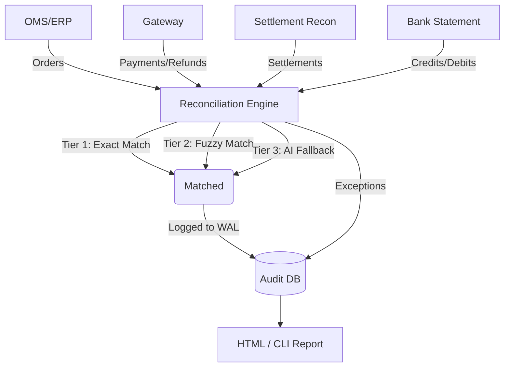

# Architecture & Data Flow

## Multi-Source Pipeline

## Boundaries & Constraints
- **Read-Only**: The engine primarily fetches data for reconciliation. It does not initiate autonomous money movement.
- **Rate-Capped LLM Calls**: To prevent runaway API costs, the Tier 3 AI exception investigation is strictly hard-capped at 15 calls per batch. Remaining exceptions safely fall back to manual review.
- **Hybrid Data**: Combines real Razorpay API reads (via test credentials) with a robust synthetic data generator to simulate complex multi-system failures safely.
